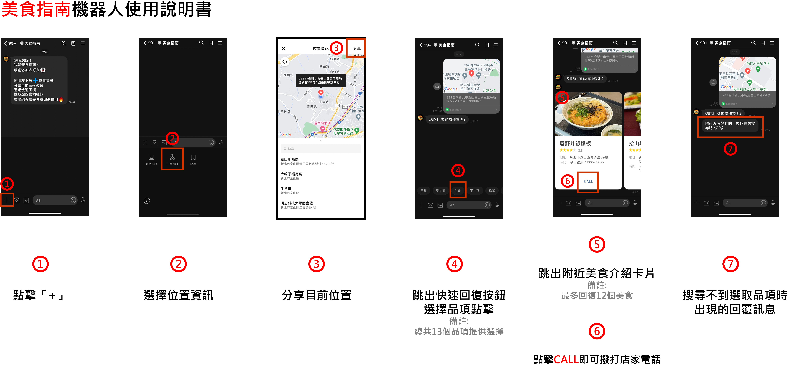

# 美食指南 LineRobot

## 機器⼈的好友 ID :@075tsdic

## 連接的公開資料來源: 愛食記 https://ifoodie.tw/

## 使⽤說明:

1. 點擊「+」
2. 選擇位置資訊
3. 分享目前位置
4. 跳出快速回復按鈕，選擇品項點擊
5. 跳出附近美食介紹卡片。當搜尋不到選取品項時，出現「附近沒有好吃的，換個種類搜尋吧 ಥ⌣ಥ」。
6. 點擊「CALL」即可撥打店家電話
7. 下列為說明圖檔
   
